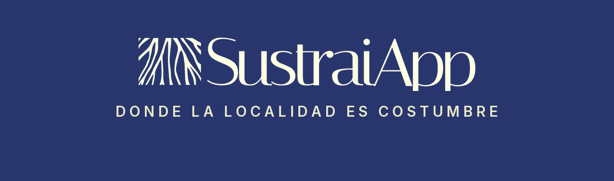

<p align="center">
  
</p>

<h3 align="center">Sistema de Recomendación Cultural y Gastronómica del País Vasco</h3>

<p align="center">
  
  
  
  
  
</p>

> Plataforma de recomendación conversacional de experiencias culturales, patrimoniales y gastronómicas de Euskadi, desarrollada en el marco del **Desafío de Tripulaciones** (proyecto multi-equipo).

<p align="center">
  
</p>

---

## Tabla de contenidos

- [Descripción](#descripción)
- [Arquitectura](#arquitectura)
- [Sistema de recomendación](#sistema-de-recomendación)
- [El chatbot conversacional](#el-chatbot-conversacional)
- [API REST](#api-rest)
- [Estructura del repositorio](#estructura-del-repositorio)
- [Stack tecnológico](#stack-tecnológico)
- [Instalación y puesta en marcha](#instalación-y-puesta-en-marcha)
- [Datos y fuentes](#datos-y-fuentes)
- [Equipo](#equipo)
- [Notas y limitaciones](#notas-y-limitaciones)

---

## Descripción

**SustraiApp** ayuda a descubrir experiencias culturales y gastronómicas de calidad en el País Vasco a través de una interfaz conversacional. El público objetivo son consumidores culturales exigentes (aproximadamente de 45 a 65 años) que buscan propuestas premium pero no elitistas.

El sistema cubre tres verticales:

- **Gastronomía** — restaurantes, sidrerías, asadores, denominaciones de origen, distinciones (Michelin, Repsol, Eusko Label).
- **Patrimonio / Cultura** — museos, patrimonio cultural, visitas guiadas, exposiciones.
- **Eventos** — conciertos, festivales, teatro, ferias y actividades por fecha y proximidad.

El usuario interactúa en lenguaje natural y el asistente devuelve recomendaciones personalizadas combinando un sistema de recomendación híbrido, un catálogo de datos abiertos de Euskadi y la información de preferencias del propio usuario.

## Arquitectura

El proyecto se organiza en tres bloques que se comunican entre sí:

1. **Capa de datos (PostgreSQL)** — esquema normalizado con catálogos (gastronomía, patrimonio, eventos), municipios, usuarios, intereses, preferencias e interacciones (reseñas y valoraciones).
2. **API REST (Flask)** — expone el catálogo, la autenticación, las preferencias del usuario, las reseñas, el chat y los endpoints de recomendación. Devuelve respuestas con la envoltura `{"data": ...}` y metadatos de paginación.
3. **Sistema de recomendación (Data Science)** — modelos entrenados y serializados (`.pkl`) que el backend consume para generar rankings personalizados, más un orquestador conversacional basado en LLM.

```
Usuario ──▶ Chatbot (LLM) ──▶ API REST (Flask) ──▶ PostgreSQL
                  │                  │
                  └──────────────────┴──▶ Modelos de recomendación (.pkl)
```

## Sistema de recomendación

El núcleo de Data Science es un **sistema híbrido** que combina dos familias de modelos por cada vertical:

- **Filtrado colaborativo (SVD)** — aprende patrones latentes a partir de las valoraciones usuario–ítem.
- **Modelo basado en contenido (XGBoost)** — usa los atributos del ítem (categoría, provincia, distinciones, etc.) y resuelve el escenario de *cold-start* cuando aún no hay historial del usuario.

Los artefactos entrenados se encuentran en `ML/models/` y `API/models/`:

| Vertical    | Colaborativo            | Contenido                  | Escalado                  |
| ----------- | ----------------------- | -------------------------- | ------------------------- |
| Gastronomía | `svd_gastro.pkl`        | `content_gastro.pkl`       | `scaler_gastro.pkl`       |
| Patrimonio  | `svd_patrimonio.pkl`    | `content_patrimonio.pkl`   | `scaler_valoracion.pkl`   |
| Eventos     | `svd_eventos.pkl`       | `content_eventos.pkl`      | —                         |

Los notebooks de entrenamiento conectados a base de datos están en `ML/`:

- `svd_gastro-db.ipynb`
- `svd-cultura-db.ipynb`
- `svd_eventos-db.ipynb`

> **En el horizonte:** una arquitectura *Two-Tower* como solución de *cold-start* en producción, actualmente demostrada como prueba de concepto arquitectónica.

## El chatbot conversacional

El asistente orquesta un LLM local (Ollama, `llama3.1:8b`) mediante *function calling* y sigue un flujo de cuatro pasos:

1. **Traducción** del mensaje a una intención normalizada.
2. **Grounding** — fijación de provincia e intereses sobre el catálogo real.
3. **Recomendación** — llamada a los modelos por vertical.
4. **Redacción** de la respuesta final en lenguaje natural.

Incluye normalización de topónimos (alias como *Donosti*, *Sanse*, *Bilbo*), *matching* difuso de provincias y memoria de sesión de un turno (provincia + intereses).

## API REST

Servidor Flask con SQLAlchemy sobre PostgreSQL. Por defecto en `http://localhost:5000`. Principales grupos de rutas:

| Grupo            | Endpoints (ejemplos)                                                                 |
| ---------------- | ------------------------------------------------------------------------------------ |
| Salud            | `GET /` · `GET /health`                                                              |
| Autenticación    | `POST /registro` · `POST /login`                                                     |
| Municipios       | `GET /api/municipios`                                                                |
| Eventos          | `GET /api/eventos` · `/esta-semana` · `/fin-de-semana` · `/cerca-de-ti` · `/en-euskera` |
| Gastronomía      | `GET /api/gastronomia` · `/mejor-valorados` · `/entorno-especial` · `/cerca-de-ti`   |
| Cultura          | `GET /api/cultura` · `/museos` · `/patrimonio` · `/visita-guiada` · `/cerca-de-ti`   |
| Preferencias     | `GET·PUT /usuarios/<user_id>/preferencias`                                           |
| Intereses        | `GET /intereses` · `GET·POST·DELETE /usuarios/<user_id>/intereses`                   |
| Reseñas          | `POST /resenas` · `GET /resenas/<entidad_tipo>/<entidad_id>`                         |
| Chat             | `POST /api/chat`                                                                     |
| Recomendaciones  | `GET /recomendaciones/gastro` · `/cultura` · `/eventos`                              |

Documentación detallada de parámetros y respuestas en [`API/RUTAS_API.md`](API/RUTAS_API.md) y [`API/API_DOCUMENTATION.md`](API/API_DOCUMENTATION.md).

## Estructura del repositorio

```
desafio/
├── API/                 # API REST en Flask + modelos servidos (.pkl) + esquema SQL
├── EDA/                 # Análisis exploratorio (gastronomía, patrimonio, Kulturklik)
├── ML/                  # Entrenamiento del recomendador (notebooks SVD + content) y artefactos
├── bbdd/                # Scripts SQL de creación e inserción de datos
├── data/                # Catálogos y datos de interacción (CSV)
├── data_process/        # Limpieza y enriquecimiento de datos crudos
├── data_sintetica/      # Datos sintéticos para validación del pipeline
├── img/                 # Gráficos generados en el EDA
├── extra/               # Branding, buyer persona y recursos de diseño
├── Memoria/             # Memoria técnica del proyecto
└── README.md
```

## Stack tecnológico

- **Machine Learning:** SVD (filtrado colaborativo) y XGBoost (modelo basado en contenido), sobre scikit-learn y pandas.
- **API / Backend:** Flask, SQLAlchemy, psycopg2, Flask-CORS, PostgreSQL.
- **LLM:** Ollama con `llama3.1:8b` (local, orquestación por *function calling*).
- **Infraestructura:** Docker Compose, entorno virtual `.venv`.
- **Análisis:** pandas, NumPy, Jupyter.

## Instalación y puesta en marcha

### Requisitos previos

- Python 3.10 o superior
- PostgreSQL
- (Opcional) Ollama con el modelo `llama3.1:8b` para el chatbot

### 1. Clonar y preparar el entorno

```bash
git clone https://github.com/jlalonsoredon/desafio.git
cd desafio

python -m venv .venv
# Windows (PowerShell)
.venv\Scripts\Activate.ps1
# Linux / macOS
source .venv/bin/activate

pip install -r requirements.txt
```

### 2. Configurar variables de entorno

Crea un fichero `.env` (nunca se versiona) con las credenciales de tu base de datos:

```env
DB_USER=tu_usuario
DB_PASSWORD=tu_password
DB_HOST=localhost
DB_NAME=sustraiapp
PGPORT=5432
```

### 3. Cargar la base de datos

Ejecuta el esquema y los inserts disponibles en `bbdd/` y `API/sustraiapp_normalized.sql` sobre tu instancia de PostgreSQL.

### 4. Arrancar la API

```bash
cd API
python app.py
```

La API quedará disponible en `http://localhost:5000`.

## Datos y fuentes

Los catálogos se construyen a partir de fuentes de datos abiertos:

- **Open Data Euskadi** y **API Kulturklik** — eventos, patrimonio y cultura.
- **IGN / CNIG** — centroides geográficos de municipios.
- **INE** — códigos oficiales de municipios.
- **Listados Michelin y Repsol** — distinciones gastronómicas.

> **Sobre los datos de usuario e interacciones:** son **sintéticos**, generados para validar el pipeline y permitir las demostraciones. No corresponden a personas reales y no deben interpretarse como métricas de rendimiento en producción.


## Notas y limitaciones

- Las métricas obtenidas sobre **datos sintéticos** validan el funcionamiento del pipeline, no la calidad real del modelo en producción.
- El modo demo genera interacciones con estructura de bajo rango (alto HR@10) y es **ilustrativo**, no representativo de un escenario real.
- La arquitectura *Two-Tower* figura en la hoja de ruta como solución de *cold-start* de producción; aún no está validada en rendimiento.


_Proyecto académico — Desafío de Tripulaciones._

